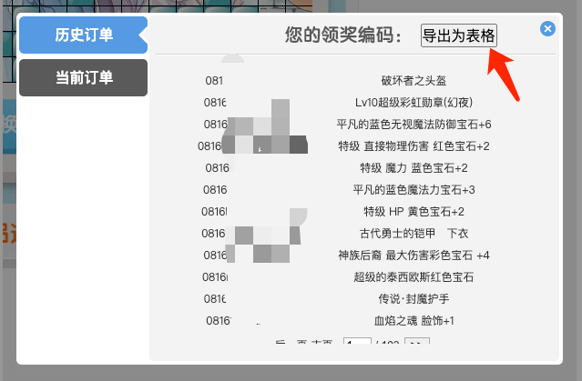

# 礼赞编码下载

支持浏览器：谷歌浏览器、QQ 浏览器、Edge 浏览器、360 浏览器等，请不要使用 IE 浏览器。
功能：导出编码为excel文件

## 效果

原“查询奖励编码”页面，会多出一个导出按钮，选择对应的订单即可下载。如图：

## 方法

### 1. 打开控制台

打开浏览器后，进入礼赞页面并登录。  
按 F12 打开开发者面板，点击 console（或叫控制台），找到输入代码的位置。

### 2. 执行代码

复制以下代码到 console 区域按回车执行  
`(鼠标移入下面的代码区域，右上角有图标可点击复制)`

<<< @/snippets/lizan/export.js

### 3. 选择下载

执行完代码后，原“查询奖励编码”页面，会多出一个导出按钮，选择对应的订单即可下载。如图：

