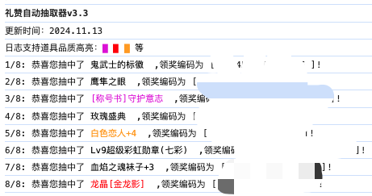

# 礼赞自动抽取

支持浏览器：谷歌浏览器、QQ 浏览器、Edge 浏览器、360 浏览器等，请不要使用 IE 浏览器。

## 效果



## 方法

### 1. 打开控制台

打开浏览器后，进入礼赞页面，登录并提前兑换好水晶。  
按 F12 打开开发者面板，点击 console（或叫控制台），找到输入代码的位置。


### 2. 执行代码

复制以下代码到 console 区域按回车执行  
`(鼠标移入下面的代码区域，右上角有图标可点击复制)`

```js
/**
 * @author 随风
 * @date 2023-08-16
 * @version v3.2
 */
(function () {
  let c = 1;
  const delay = () => 2000 + Math.random() * 1000;
  console.log("礼赞自动抽取器v3.2");
  console.log("2023.8.15 支持新版礼赞");
  let allCount = getCount();

  async function main() {
    if (allCount >= c) {
      const { Timestamp, Sign } = await getSign();
      const block = await getRandomBlock();
      await getAward({
        Position: block.id,
        Timestamp,
        Sign,
        allCount,
      });
      setTimeout(() => {
        main();
      }, delay());
    } else {
      console.log("抽奖次数已使用完毕。");
    }
  }

  function request(url, data = {}) {
    return new Promise((resolve) => {
      $.getJSON(url, data).done((json) => resolve(json));
    });
  }

  async function getSign() {
    return new Promise((resolve) => {
      $.ajax({
        url: "home.asp",
      }).done((html) => {
        const Timestamp = html.match(/var Timestamp="(\d+)";/)[1];
        const Sign = html.match(/var Sign="([a-zA-Z0-9]+)";/)[1];
        resolve({
          Timestamp,
          Sign,
        });
      });
    });
  }

  async function getRandomBlock() {
    const { data } = await request("Interface/getList.asp");
    const list = data.filter((item) => item.status === "block");
    const randomIndex = Math.floor(Math.random() * list.length);
    return list[randomIndex];
  }

  async function getAward({ Position, Timestamp, Sign, allCount }) {
    const json = await request("interface/getAward.asp", {
      t: Math.random(),
      ItemLevel: 1,
      Position,
      d: 1,
      Timestamp: Timestamp,
      Sign: Sign,
    });
    if (json.result >= 1) {
      console.log(
        `${c++}/${allCount}: 恭喜您抽中了` +
          json.itemname +
          " ,领奖编码为 [ " +
          json.couponnum.split("#")[0] +
          " ]!"
      );
    } else if (json.result == -4) {
      console.log(
        `抽奖次数已使用完毕，已遗漏上报${
          allCount - c + 1
        }个奖励，请在我的订单中对比查询遗漏的奖励。`
      );
      throw new Error("脚本结束");
    }
  }

  function getCount() {
    var content = document.querySelector("#logout").textContent;
    var count = content.match(/\[(\d+)\]/);
    return +count[1] || 0;
  }

  return main();
})();
```

### 3. 执行效果


