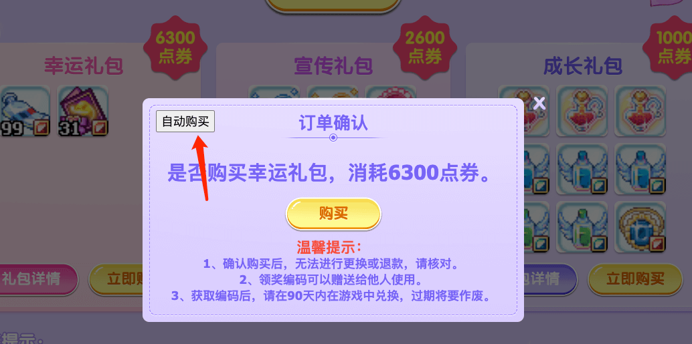

# 等级补完自动购买器

支持浏览器：谷歌浏览器、QQ 浏览器、Edge 浏览器、360 浏览器等，请不要使用 IE 浏览器。

## 1. 打开控制台

打开浏览器后，进入礼赞页面并登录。  
按 F12 打开开发者面板，点击 console（或叫控制台），找到输入代码的位置。


## 2. 执行代码

复制以下代码到 console 区域按回车执行  
`(鼠标移入下面的代码区域，右上角有图标可点击复制)`

```js
/**
 * @author 随风
 * @date 2023-08-22
 * @version v1.0
 */
(function () {
  let c = 0;
  const delay = 1000;
  async function getSign() {
    return new Promise((resolve) => {
      $.ajax({
        url: "./index.asp",
      }).done((res) => {
        const [, Sign, Timestamp] = res.match(
          /Sign:"([a-zA-Z0-9]+)",Timestamp:"(\d+)"/
        );
        resolve({
          Sign,
          Timestamp,
        });
      });
    });
  }

  async function buy({ Sign, Timestamp, price }) {
    return new Promise((resolve) => {
      $.getJSON(
        "inc/buy.asp",
        {
          t: Math.random(),
          price,
          Sign,
          Timestamp,
        },
        function (data) {
          console.log(data.message);
          if (data.result == "1") {
            c++;
            console.log("购买成功：" + c + "次");
          }
          resolve();
        }
      );
    });
  }

  async function start(price) {
    const { Sign, Timestamp } = await getSign();
    await buy({ Sign, Timestamp, price });
    setTimeout(() => {
      start(price);
    }, delay);
  }

  async function initialScript() {
    $("#autoBuy").remove();
    $("#pop3").append(
      "<button style='position: absolute; top: 20px; left: 20px;' id='autoBuy'>自动购买</button>"
    );
    $("#autoBuy").click(function () {
      const script = $(".buy-btn").attr("href");
      const [, price] = script.match(/buy\((\d+)\);/);
      start(+price);
    });
  }
  initialScript();
})();
```

## 选择购买

选择需要购买的物品，点击弹框右上角”自动购买“按钮即可无限购买。console 中会有购买日志

